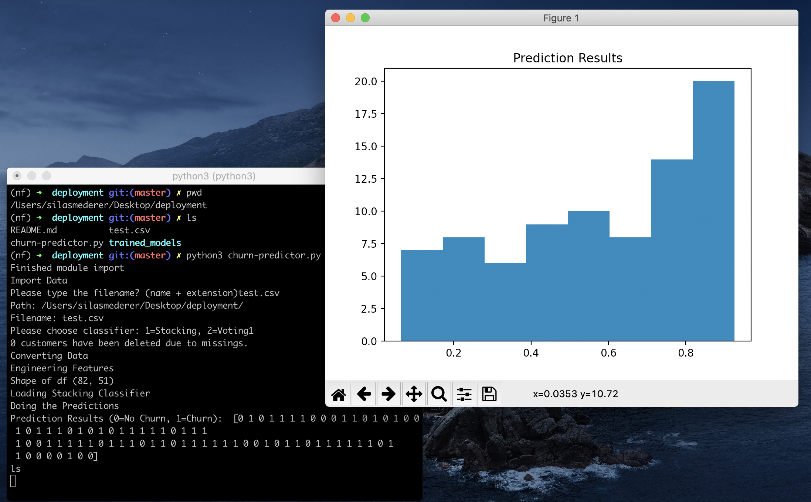

# Model for churn prevention die Zeit Verlag

**Team:** Jonas Bechthold, Silas Mederer & Carlotta von Ulm Erbach

**Business Case:** Churn prevention is your proactive strategy for keeping customers around. It involves looking at the underlying reasons for churn and then formulating a plan to combat issues that may lead to churn before they happen.

**Goal:** Improve the model of ‘Die ZEITVerlag’ to do better predictions.

**Metric:** 
* Recall: to identify as many real subscription churns  
* Precision: to avoid disturbing loyal customers with unnecessary mails 
* AUC and probability distribution

**Overview:** 
Since a large number of features (177) exists, feature selection and engineering as part of an extensive EDA was essential. 

For the supervised (with label) ML the data imbalance must be handled. The aim is to identify as many as possible “real” subscription churns as possible. Incorrectly identifying “non real” churns is not of the highest priority (Recall vs. Accuracy), since we would recommend churn mitigation methods for these subscribers. The main target is therefore to understand the behavioral patterns of customers and to optimize the churn prevention while reducing the overall cost. 

We used different machine learning (supervised and unsupervised) approaches to predict churns of subscriptions of the german weekly newspaper “Die Zeit”. As it is a binary classification problem (“churn” or “no churn”), we used Logistic Regression as a baseline model, and KNN, Random Forest and XGBoost for further optimization. We also implemented a stacking and voting classifier, where we combined all classifiers to one. Unsupervised machine learning methods have been used to improve the prediction. 

We built ANN and DNN and implemented the “deep and wide” approach. We were able to improve our baseline ANN but not able to score higher in recall on “churn”. So at the end of this project we decided to implement the stacking and voting classifiers, wrote a script and readme, to hand it over for die ZEITVerlag, so that their operators could use our trained models.

**Methods and Technologies:** Preprocessing (Cleaning, EDA), supervised ML classification (Logistic Regression, KNN, RF, XGBoost, Stacking, Voting), advanced methods consisting of ANN (DNN, deep and wide Network)

**Recommendations and findings:** We recommend to our stakeholders to contact the customers 10 month after the subscription for the first time and then every 12 month. This recommendation is based on the feature “lesedauer” and its distribution. Also we would recommend to use more and especially more user specific and time related features, the digital subscription becomes more and more important, it must be easy to scrape this kind of information for the publisher. If this will be done, it would be possible to use a CNN model on clickrates or customer behavior which are more precise and could be used to not only predict “churn” or “no churn” but also the point of churn in time. These are important information if you want to bound your customer. 

Overall we were able to relatively improve the referenced model by 14% in recall and 25% in precision and would recommend to use a soft voting classifier (option 2 in the script) for predictions. This one provides a recall of 79%, precision of 59% and an accuracy of 77%. But as you can see we still miss about 23% of the dataset respectively predict them wrong. 

**Repository content:**
- [EDA Notebook](/Capstone_Zeit_EDA.ipynb)
- [ML Notebook](/ML-Capstone_Zeit.ipynb)
- [ANN Notebook](/ANN-Capstone_Zeit.ipynb)
- [Model Tuning:](/ml-modelle) KNN, Logistic Regression, Random Forest I, Random Forest II, SVC, XGBoost
- [Error analysis](/customer_segmentation/ML-error_analysis.ipynb)
- [Customer segmentation](/customer_segmentation/Customer_segmentation_Selection_ML.ipynb)
- [Deployment](/deployment)
- [Presentation](/Capstone_Zeit_Presentation.pdf)
  

